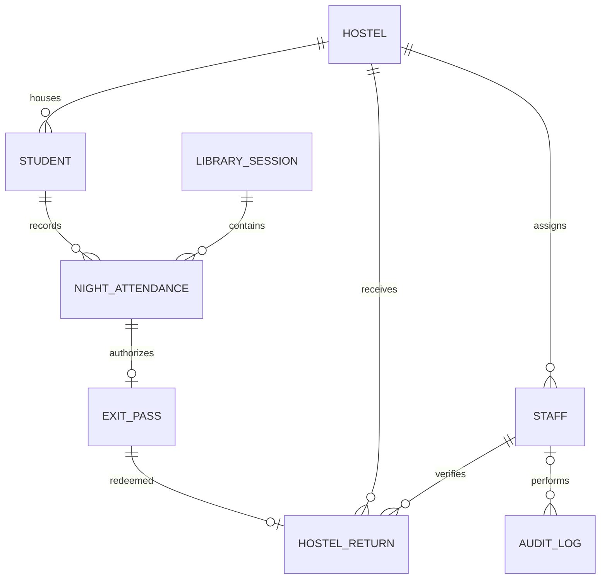

# Relational model

```mermaid
erDiagram
  HOSTEL ||--o{ STUDENT : houses
  HOSTEL ||--o{ STAFF : assigns
  STUDENT ||--o{ NIGHT_ATTENDANCE : records
  LIBRARY_SESSION ||--o{ NIGHT_ATTENDANCE : contains
  NIGHT_ATTENDANCE ||--o| EXIT_PASS : authorizes
  EXIT_PASS ||--o| HOSTEL_RETURN : redeemed
  HOSTEL ||--o{ HOSTEL_RETURN : receives
  STAFF ||--o{ HOSTEL_RETURN : verifies
  STAFF o|--o{ AUDIT_LOG : performs
```

Pass and return uniqueness are database constraints. Trigger side effects are in the caller's transaction. No biometric images are stored.
